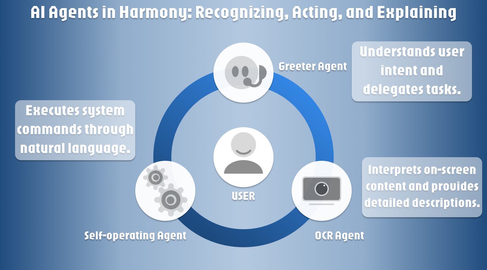

# 🎙️ VoiceNavigator

**VoiceNavigator: AI-Powered Speech-to-Speech Web Interaction System**


<p align="center">
  🌐 <a href="https://kujicheng.github.io/VoiceNavigator-webpage/">Visit VoiceNavigator Webpage</a>
</p>

<!-- [](https://kujicheng.github.io/VoiceNavigator-webpage/)

Check out our project: [VoiceNavigator Webpage](https://kujicheng.github.io/VoiceNavigator-webpage/) -->


VoiceNavigator is an innovative application that combines real-time voice assistance, LLM-driven computer operation, and image-to-text tasks to enable a hands-free online web browsing experience. With the power of AI, it allows you to navigate, operate, and interact with your computer and web applications using voice commands.

## ✨ Features

<p align="center">
  
</p>


1. 🎧 **Real-Time Voice Assistant**: Interact with the system seamlessly using voice commands.
2. 🤖 **LLM-Driven Computer Operations**: Perform actions like opening applications, interacting with web pages, and more.
3. 🖼️ **Image-to-Text Tasks**: Extract and interpret text from images for enhanced accessibility and productivity.

## 🚀 How It Works

- Leveraging large language models (LLMs) for understanding and executing complex commands.
- For example:
  - Saying "Open YouTube" and "Open Chrome" triggers the backend API, letting the LLM operate your computer to perform these tasks.
  - The LLM can also describe the content of the webpage you're interacting with, providing contextual insights.

Enjoy a fully hands-free, voice-controlled experience powered by cutting-edge AI technologies.

---

## 🛠️ Getting Started

### ✅ Prerequisites

- **OpenAI API Key**: Required for NLP capabilities. Get one at [OpenAI Platform](https://platform.openai.com/) (requires OpenAI account and payment method). Add the key to the `.env` file.
- **Node.js**: Ensure you have Node.js installed for the frontend.
- **Python**: Required for running the backend.

---

### 🌐 Frontend Setup

The frontend is a **Next.js TypeScript** app.

1. Clone the repository and navigate to the project directory for the frontend.
2. Install dependencies:
   ```bash
   npm install
   ```
3. Add your OpenAI API key to the `.env` file:
   ```plaintext
   OPENAI_API_KEY=your_openai_api_key_here
   ```
4. Start the server:
   ```bash
   npm run dev
   ```
   The frontend server will start, and you can interact with the system via the web interface.

---

### ⚙️ Backend Setup

The backend is a Flask app that supports LLM-driven operations and image-to-text tasks.

1. Navigate to the backend directory:
   ```bash
   cd ./src/VoiceNavigatorBackend
   ```
2. Install the package and its dependencies:
   ```bash
   pip install .
   ```
3. Run the backend server:
   ```bash
   python app.py
   ```
   The backend will host an API to enable:
   - 🤖 LLM-driven computer operations, such as opening applications or interacting with web pages.
   - 🖼️ Image-to-text functionality for interpreting screenshots and suggesting next actions.

---

## 🔑 Key Features in Action

- 🗣️ Hands-Free Operations: Use natural language to interact with your computer and web apps.
  - Example: Say "Open YouTube" to launch YouTube in a browser.
  - The system can also describe web pages, giving you contextual understanding of the content and guidance on possible next actions.
- 🌟 AI-Powered Accessibility: Extract text from images or perform operations without touching a keyboard or mouse.

---

## 🎉 Enjoy the Experience!

With VoiceNavigator, you can fully embrace a hands-free online experience, powered by state-of-the-art AI capabilities. Let the power of your voice do the work for you.

Feel free to explore, experiment, and enjoy! 🎊
